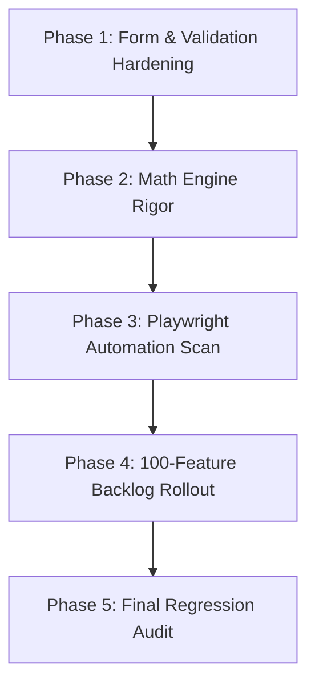

# The Prepayment Ledger: Automated Bug Bounty & 100-Feature Expansion Manifesto

This document outlines the rules, methodology, phases, and 100-feature expansion backlog for the **Prepayment Ledger Bug Bounty & Hardening Program**. The execution runs in sequential phases utilizing Playwright E2E browser checks and Vitest mathematical verification.

---

## 🧭 1. Program Methodology & Rules

### Core Rules
1. **Rigor Over Speed**: Every bug identified must not only be patched but *hardened* by adding a corresponding test case to prevent regression.
2. **Customer-Focus**: Every adjustment, warning message, or calculation must directly help the B2C borrower save money and understand lender rules.
3. **No Placeholders**: All mock forms, calculators, and drawer tabs must be fully functional and mathematically sound.

### The Diagnostic Loop
For every check conducted:
```
[Identify Input/Form] -> [Run Boundary Test] -> [Validate Against Bank Rules] 
       |
       +---> [If Bug Found]: Patch -> Add Test Case -> Harden Boundary
       |
       +---> [If Clean]: Log Verified -> Check Downstream Impacts
```

---

## 📅 2. Implementation Phases



### Phase 1: Form & Validation Boundary Hardening
* Target: Inputs in Loan cards, windfalls, rate changes, and email captures.
* Checks: Negative numbers, zero value inputs, blank names, empty arrays, rate values above 100%, and extremely long strings.

### Phase 2: Mathematical Engine & Rule Alignment
* Target: Amortization logic, prepayment reduction models, and bank rule boundaries.
* Checks: Floating rate change timeline edge cases, calendar month overlaps, 13th EMI step-ups, and windfall rounding rules.

### Phase 3: Playwright E2E Test Expansion
* Target: Automated TUI browser simulations.
* Checks: Creating scripts simulating multiple user types (e.g., HDFC borrower, SBI floating rate client, windfall saver).

### Phase 4: 100-Feature & Experience Backlog Rollout
* Implement the comprehensive backlog to expand the utility.

### Phase 5: Final Regression Audit
* Verify that all 25 Vitest unit tests and all expanded Playwright E2E scripts pass cleanly.

---

## 📝 3. The 100-Feature & Experience Backlog

Below is the planned registry of 100 features and user experience refinements divided into functional categories:

### A. Core Mathematical Engine (1-20)
1. **Dynamic Step-Up EMIs**: Support a yearly step-up percentage (e.g. increasing EMI by 5% every year as income rises).
2. **Varying Float Rate Schedules**: Support inputting multiple floating rate changes over the loan timeline.
3. **Semi-Annual Prepayments**: Allow recurring prepayments every 6 months.
4. **Bi-Weekly Payment Schedule**: Optional payment frequency calculator to save interest via velocity.
5. **Loan Refinancing Evaluator**: Compare current loan against balance transfer offers (factoring in processing fees).
6. **Pre-EMI Interest Accumulator**: Factor in pre-EMI payments for under-construction properties.
7. **Lump Sum vs. SIP Calculator**: Side-by-side comparison of investing a windfall in a mutual fund (via SIP) vs. prepaying.
8. **Principal Moratorium Option**: Simulate a temporary pause in principal payments (e.g. during a career break).
9. **Balloon Payment Calculator**: Support structured larger payments at specific milestones (e.g. Year 5, Year 10).
10. **Tax Savings Deductor (Sec 24b/80C)**: Calculate net-of-tax interest savings based on the user's tax bracket.
11. **Negative Interest Float Check**: Safeguard engine against negative rates.
12. **Tenure Extension Warn Loop**: Notify if a rate hike makes the loan mathematically infinite (EMI doesn't cover interest).
13. **RBI Floating Rate Switch Tracker**: Calculate cost-benefit of switching from fixed to floating.
14. **Daily Reducing Balance Option**: Support calculations for SBI MaxGain-style daily reducing interest accounts.
15. **HDFC 75% Principal Lock Checks**: Prevent prepayments exceeding 75% of the starting annual principal.
16. **SBI 1-Month Lock Checks**: Verify that part-payment is locked out in Month 1.
17. **RBI Prepayment Cost Waiver Engine**: Verify zero penalty rules apply for floating-rate home loans.
18. **Custom Minimum Part-Payment Rules**: Let users specify lender minimum thresholds (e.g., "Min 3 EMIs").
19. **Rollover Budget Spillover Check**: Handle cases where extra budget exceeds remaining balances.
20. **Tenure vs EMI Reduction Swapper**: Let users toggle prepayment impact per-loan.

### B. UI/UX Cockpit Experience (21-40)
21. **Theme Toggle (☀️ / 🌙)**: Completed.
22. **Collapsible Loan Cards**: Tidy up the left panel when managing many loans.
23. **Draggable Reordering**: Let users drag-and-drop loans to change payoff priority.
24. **Crossover Milestones**: Visual indicators showing when principal paid exceeds interest paid.
25. **Percentage Progress Bar**: Visual loading/completion indicator per loan.
26. **Compact Tabbed Loan Details**: Completed.
27. **Print-to-PDF Media Queries**: Stylize print styles for a premium offline broadsheet look.
28. **Interactive Area Legend**: Toggling a legend item highlights/fades that area in the chart.
29. **Drag-and-Drop Sliders**: Completed.
30. **INR Currency Formatter**: Compact formatting (e.g. ₹5.3L instead of ₹5,30,000).
31. **Interactive Tooltips**: Detailed data points on hover.
32. **CSS Hover Card Lifts**: Completed.
33. **A/B Headline Toggles**: Completed.
34. **Tabbed Email Sequence Envelope**: Completed.
35. **Free Leads Table Panel**: Completed.
36. **Quick Share Button**: Copy dashboard configuration as a short URL (base64 encoded).
37. **Scroll-to-Top Button**: Smooth navigator for long pages.
38. **Zero Debt Fireworks Animation**: Celebrate when outstanding debt hits 0.
39. **Interactive Onboarding Tour**: Walkthrough overlay for first-time visitors.
40. **Mobile Keyboard Dismissals**: Tapping outside input fields hides active mobile keyboards.

### C. Data Portability & Integrations (41-60)
41. **CSV Export for Rollovers**: Completed.
42. **CSV Export for Leads**: Completed.
43. **JSON Local Backup**: Export loan configuration to a local JSON file.
44. **JSON Local Restore**: Import a previously exported JSON backup.
45. **PDF Blueprint Generation**: Export a high-fidelity vector PDF payoff report.
46. **Local Storage Auto-Save**: Save workspace state automatically.
47. **Workspace Clear & Reset**: Reset layout to defaults.
48. **Supabase Auto-Sync (Edge)**: Setup sync status indicator (online/offline).
49. **Offline Workspace Cache**: Service worker support for offline usage.
50. **Bank Prepayment Rules Catalog**: Pull rule guides from a local registry.
51. **Lead Email Validation**: Check syntax correctness before saving leads.
52. **Duplicate Email Check**: Update lead info if email already exists instead of duplicating.
53. **Lead Savings Value Tracking**: Store calculated interest savings per lead.
54. **CSV Leads Format Configuration**: Let admin select export fields.
55. **CSV Schedule Layout Cleanups**: Align columns for Excel compatibility.
56. **Prepayment CSV Import**: Let users upload a CSV of past part-payments.
57. **External Bank Link Referral**: Non-intrusive redirection to bank calculators.
58. **Privacy Charter PDF**: Include legal data privacy statement in PDF downloads.
59. **Workspace Session Locking**: Passcode protect local browser settings.
60. **Browser Tab Unsaved Warn**: Prompt if user tries to close tab with unsaved configurations.

### D. Educational & Learning Assets (61-80)
61. **5-Stage Welcome Drip Drawer**: Completed.
62. **Interest-Shock Visualizer**: Show front-loaded interest traps.
63. **Amortization Explainer Tool**: Simple tooltip explainers for terms.
64. **"Avalanche vs Snowball" Explainer**: Toggles explaining math vs psychological wins.
65. **Windfall Split Logic Explainer**: Show why emotional 50/50 splits lose money.
66. **RBI Regulatory Charter Panel**: Display official RBI 2026 guidelines.
67. **Refinancing Break-Even Calculator**: Explains how long before switch fee pays off.
68. **Floating Rate Risk Assessment**: Standard deviation simulator for interest hikes.
69. **"Debt-Free Date" Countdown Widget**: Dynamic countdown to the day of absolute freedom.
70. **Monthly Budget Analyzer**: Show what percentage of income goes to EMIs.
71. **Savings Value Comparison Widget**: Show what else that saved interest could buy (e.g. car, retirement).
72. **Part-Payment Calendar Alert Planner**: Setup alerts for optimum part-payment dates.
73. **FAQ Accordion Drawer**: Completed.
74. **Advisor Mode Teaser**: Preview advisor white-label features.
75. **Sovereignty & Trust Callouts**: Completed.
76. **Floating Rate Volatility Simulator**: Random walk simulator for interest rates.
77. **Debt-to-Income (DTI) Gauge**: Interactive meter showing financial stress.
78. **Interest Rate History Chart**: Indian home loan market averages reference.
79. **EMI Buffer Calculator**: Compute safety net needed for potential rate increases.
80. **Windfall Allocator Interactive Widget**: Completed.

### E. Security, Performance & Hardening (81-100)
81. **Input Sanitization**: Strip dangerous scripts from loan names.
82. **CSS Variables Lightness Balance**: Verify contrast ratios conform to WCAG AA.
83. **Memory Leak Protections**: Clean up all event listeners and canvas animations.
84. **Recharts Resize Protection**: Fix sizing issues on rapid resizing.
85. **Floating Rate Date Validation**: Prevent changes starting before loan start date.
86. **Negative Balance Protections**: Prevent closing balances below 0.
87. **Infinite Loop Breaks**: Halt calculations if amortization rows exceed 600.
88. **UUID Safe Generation**: Completed.
89. **Supabase RLS Rules**: Secured public/private RLS data access.
90. **Autocleaning Data Helpers**: Trim inputs on blur.
91. **Debounced Calculations**: Prevent recalculations on every keystroke.
92. **Vite Single-File Inliner Security**: Ensure inlined code is valid and sandboxed.
93. **Error Boundaries**: Render fallback if chart or calculations fail.
94. **Strict Type Safety**: Eliminate any `any` usage in the calculations engine.
95. **Vitest Unit Coverage**: Ensure minimum 90% coverage for math algorithms.
96. **Playwright E2E Multi-Browser Checks**: Verify compatibility across Chrome, Safari, Firefox.
97. **Floating Rate Sorting**: Auto-sort rate change logs by month index.
98. **Double Form Submission Block**: Disable submit buttons during asynchronous actions.
99. **Supabase Config Ports Mapping Check**: Local developer port locks.
100. **Weekly Automated Cron Regression**: Completed.
